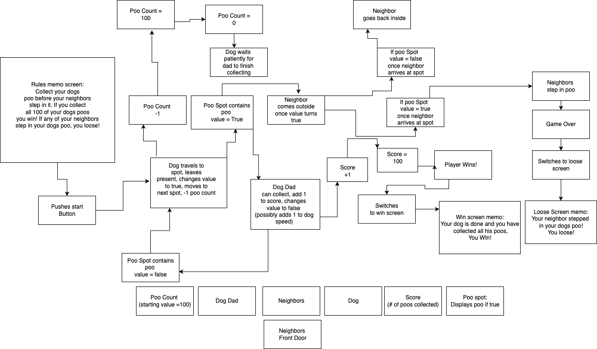

Overview:
The pup has to go! Take your dog outside and collect its poo. If your neighbors step in the poo before you collect it, you loose. If you collect all the poo your dog has to offer without any of your neighbors stepping in it, you win!

As a user, I want the ability to... 
  - Move around the neighborhood
  - Collect all the poo my dog has to offer
  - Collect all the poo before my neighbors collide with it
  - See my dog run around
  - See my dog lay his poo
  - See my dogs poo 
  - See my neighbors come outside
  - See my neighbors walk towards the poo spot
  - See the win screen when I have collected all my dogs poo
  - See a loose screen when my neighbors step in poo

  Mon: HTML and css layout
  Tues: Canvas layout
  Wed: Pseudo code function layout
  Thurs: Write out functions
  Fri: Write out functions
  Sat: Write out functions
  Sun: Graphic design 

  
  

Dog: {
  x: (x location on the canvas)
  y: (y location on the canvas)
  height: (should be smaller than Dad)
  width: (should be smaller than Dad)
  color: (sprite)
  active: (a boolean that determines if game is in progress)
  render: (a method that displays the dog on the screen)
}

Dad: {
  x: (x location on the canvas)
  y: (y location on the canvas)
  height: (should be taller than dog)
  width: (should be wider than dog)
  color: (sprite)
  active: (a boolean that determines if game is in progress)
  render: (a method that displays the Dad on the screen)
}

Neighbor: {
  x: (x location on the canvas)
  y: (y location on the canvas)
  height: (should be same size as Dad)
  width: (should be same size as Dad)
  color: (sprite)
  active: (a boolean that determines if game is in progress)
  render: (a method that displays the Neighbor on the screen)
}

PooSpot: {
  x: (x location on the canvas)
  y: (y location on the canvas)
  height: (should be smaller than dog)
  width: (should be smaller than dog)
  color: (sprite)
  active: (a boolean that determines if dog has gone)
  render: (a method that displays poo if valued true)
}

frontDoor: {
  x: (x location on the canvas)
  y: (y location on the canvas)
  height: (should be same size as neighbor)
  width: (should be same size as neighbor)
  color: (sprite)
  active: (a boolean that determines if neighbor has returned)
  render: (shouldn't need to render anything, will be invisable box on top of front door background)
}
(optional)

redBullSpot: {
  x: (x location on the canvas)
  y: (y location on the canvas)
  height: (should be same size as pooSpot)
  width: (should be same size as pooSpot)
  color: (sprite)
  active: (a boolean that determines if player needsPerc)
  render: (a method that displays redBull if valued true)
}

function - gameloop - holds the entire logic that runs the game

function - dadMoves - used to move the dad around, should be attached to arrow or wasd keys

function - dogMoves - used to move dog to next (or random) false valued poo spot

function - dogGoes2 - activates when dog collides with false valued poo spot, calls pooCountDecrease(), pooApears(), dogMoves() and neighborWakes()

function - pooAppears - turns pooSpot's value to true

function - pooGone - turns pooSpot's value to false

function pooCountDecrease - -1 to poo count

function neighborWakes - creates neighbor sprite and calls neighborMoves()

function - neighborMoves - used to move the neighbor to poo spot 

function - neighborSteps - used to see if neighbor collided with true or false valued poo spot, calls (gameOverLoose() if true) and (neighborGoesBack() if false)

function - neighborGoesBack - used to send neighbor back home and calls byeNeighbor()

function byeNeighbor - used to remove neighbor when neighbor collides with front door

function - pooCollected - calls(scoreIncrease()) and (pooGone()) when player collides with true valued poo spot (possibly calls dogGoFast())

function - dogGoFast - adds 1 to dog speed (optional) 

function - scoreIncrease - adds 1 to player score 

function - gameOverLoose - ends game when neighbor collides with true valued poo spot, activaes 'game over screen'

function - gameOverWin - ends game when poo count = 0

(optional)

function - dadGoFast - adds 1 to dad speed when collided with true valued redBullSpot

function - needsPerc - changes redBullSpot's value to true when player score reaches 25

