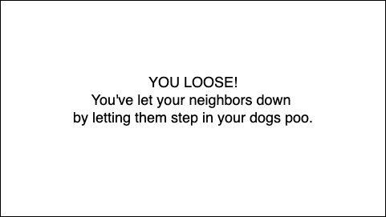
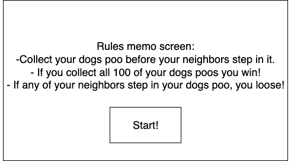

# Space Chaser

Space Chaser is a frantic 2D browser game where you play as an astronaut guard racing to round up alien prisoners before they escape a cosmic detention yard. Intercept runaways and use power-ups to outmaneuver crafty extraterrestrials as they change routes mid-chase. The game’s fluid sprite animations, frame-rate–independent controls, and state-based movement systems let prisoners switch between behaviors like running, waiting, and escaping. A centralized game state synchronizes character positions, collision detection, and timed events, keeping gameplay smooth and consistent across devices. Built with HTML5 Canvas and JavaScript.

Justin Hewinson – Sole creator and developer of Space Chaser

---

## As a user, I want the ability to...

- Move my astronaut smoothly around the detention yard using keyboard controls.
- Chase down alien prisoners as they escape.
- See prisoners switch behaviors (waiting, running, escaping).
- Use power-ups (like speed boosts or stuns) to gain an advantage.
- See sprite animations for astronaut, aliens, and power-ups.
- Trigger a win screen when all prisoners are caught.
- Trigger a lose screen when prisoners escape beyond recovery.
- Experience fluid gameplay that adjusts to frame-rate across devices.

---

## General Approach

Space Chaser uses a state-driven system where every character (astronaut and aliens) updates its behavior and animation frame on each tick of the game loop. A centralized game state keeps track of positions, collisions, and timing events to ensure smooth play. Alien AI uses a combination of randomization and goal-seeking logic to make their movement unpredictable but fair. 

Collision detection is handled through bounding box checks, with additional logic for handling overlapping events such as prisoner recapture, power-up collection, and escape thresholds.

---

## Technologies Used

- **Rendering & Looping**
  - HTML5 Canvas
  - JavaScript
  - Frame-rate–independent `deltaTime` loop

- **Game Systems**
  - State-based movement for aliens
  - Centralized game state management
  - Collision detection
  - Power-up spawning & collection
  - Sprite-sheet animations

---

## Core Entities

**Astronaut (Player):**
- Position (x, y)
- Speed (affected by power-ups)
- Sprite render
- Collision with aliens and power-ups

**Alien (Prisoner):**
- Position (x, y)
- Behavior state (waiting, running, escaping)
- Sprite render
- AI logic for movement and escape routes

**PowerUp:**
- Position (x, y)
- Type (speed boost, stun, etc.)
- Active state
- Render method
- Collision with astronaut triggers effect

---

## Wireframes & Screenshots

_Game Concept Diagrams_  
  
  

_Win / Lose Screens_  
  
  

_Start Screen_  

---

## Future Improvements

- Expanded alien AI with more complex escape strategies.
- Multiple level designs with different layouts.
- Additional power-ups (shields, traps, etc.).
- Local high-score tracking.
- Mobile-friendly touch controls.
